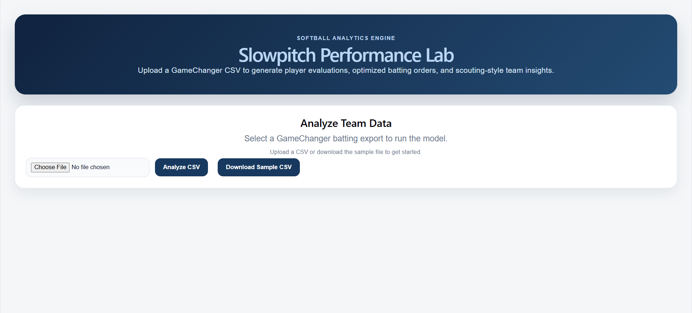
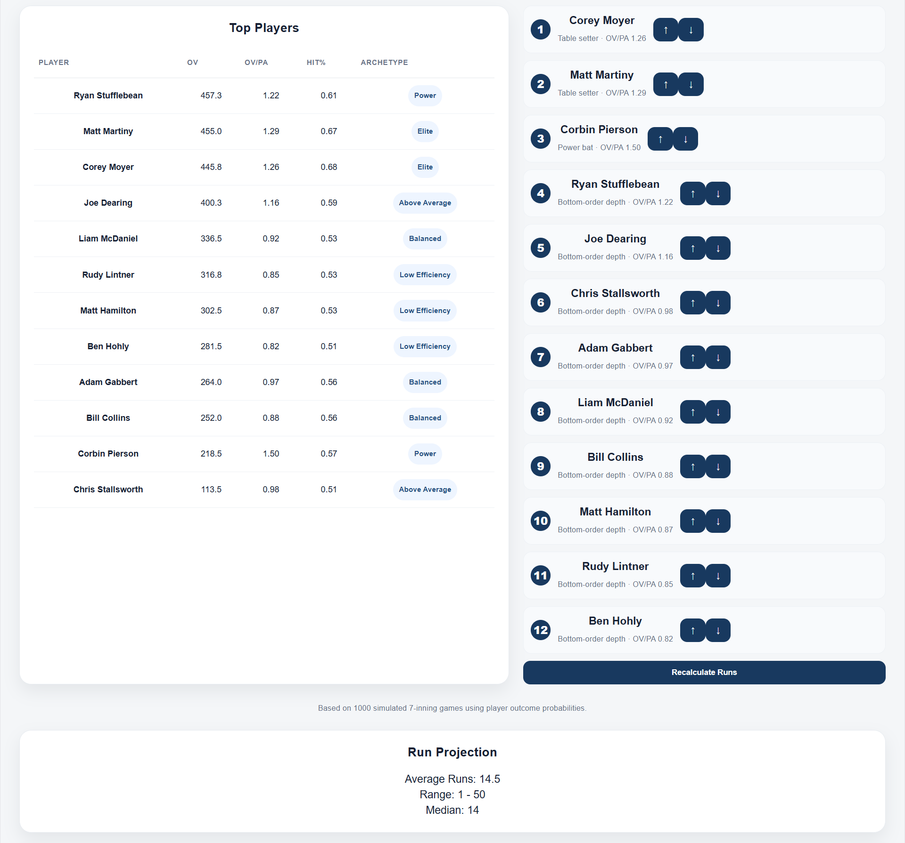
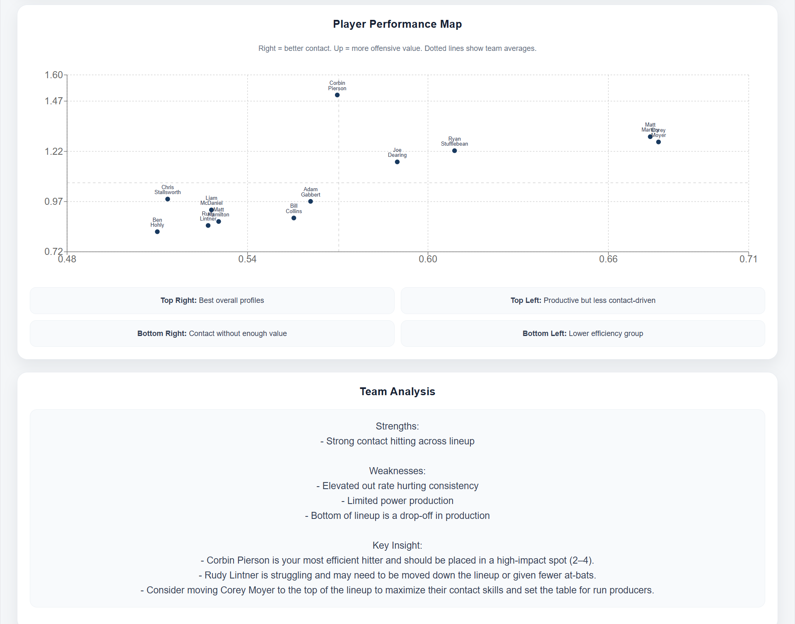
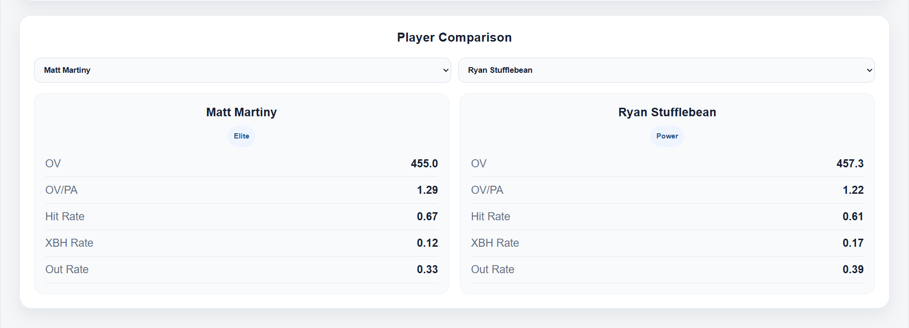

# Slowpitch Performance Lab

## Screenshots

### Upload

### Results

### Performance Chart & Team Analaysis

### Player Comparison

---

## What This Solves

Helps softball teams answer:

- Who should bat where?
- How much does lineup order matter?
- Which players actually drive runs?
- What lineup scores the most runs?

---

A full-stack softball analytics platform that transforms GameChanger CSV exports into actionable lineup decisions, player evaluations, and run projections.

---

## Live Demo

https://slowpitchlab.mattmartiny.com

---

## Features

- Upload GameChanger CSV exports  
- Player performance scoring (Offensive Value, Value per PA)  
- Archetype classification (Power, High Floor, Boom/Bust, etc.)  
- Optimized 12-player batting order generation  
- Interactive lineup editor (reorder players)  
- Run projection simulator (Monte Carlo simulation)  
- Lineup comparison (optimized vs user-adjusted)  
- Player comparison tool  
- Visual analytics (performance scatter plot)  

---

## Overview

This project combines data engineering, analytics, and simulation modeling to replicate real-world baseball decision-making workflows.

### Data Pipeline
- Cleans and normalizes multi-header GameChanger exports  
- Handles missing data (e.g., derives singles from hits)  
- Standardizes player identity across datasets  

### Metrics Engine
- Offensive Value (OV): weighted run contribution metric (wOBA-inspired)  
- OV/PA: efficiency per plate appearance  
- Hit Rate / XBH Rate / Out Rate: player profile indicators  

### Player Archetypes
Classifies hitters into roles such as:
- Table Setter  
- Run Producer  
- Power Hitter  
- High Floor / Low Efficiency  

### Lineup Optimization
Builds a 12-player batting order based on:
- Efficiency  
- Role fit  
- Lineup balance  

### Simulation Engine
- Monte Carlo simulation (1000 games)  
- Models each plate appearance probabilistically  
- Tracks base advancement and scoring  
- Outputs:
  - Average runs  
  - Min / max range  
  - Median runs  

---

## Example Output

### Batting Order

1. Corey Moyer — Table Setter (OV/PA: 1.82)  
2. Matt Martiny — Table Setter (OV/PA: 1.79)  
3. Corbin Pierson — Run Producer (OV/PA: 1.75)  

---

### Team Analysis

Strengths:
- Strong contact hitting across lineup
- High overall offensive efficiency

Weaknesses:
- Bottom of lineup shows production drop-off

Key Insight:
- Matt Martiny is the most efficient hitter and should be placed in a high-impact spot (2–4)

---

### Run Projection

Optimized Lineup: 19.4 runs/game  
User Lineup: 17.8 runs/game  
Difference: +1.6 runs/game  

---

## Tech Stack

### Frontend
- React (Vite)  
- Recharts  
- Custom CSS  

### Backend
- FastAPI (Python)  
- Pandas / NumPy  

### Deployment
- Render (backend API)  
- Plesk (frontend hosting)  

---

## Project Structure

src/
  api.py                # FastAPI endpoints
  analyzer.py           # Analysis pipeline
  load_gamechanger.py   # CSV ingestion & normalization
  metrics.py            # Player metric calculations
  archetypes.py         # Player classification
  team_optimizer.py     # Batting order logic
  simulator.py          # Run simulation engine
  report.py             # Team insights

---

## Running Locally

pip install -r requirements.txt  
python src/main.py  

---

## Why This Matters

This project mirrors real analytics workflows:

- Data cleaning and normalization  
- Metric engineering  
- Player segmentation  
- Optimization modeling  
- Simulation-based decision making  

It demonstrates the ability to move from raw data to insights to interactive decision tools.

---

## Author

Matt Martiny  
Kansas City, KS
