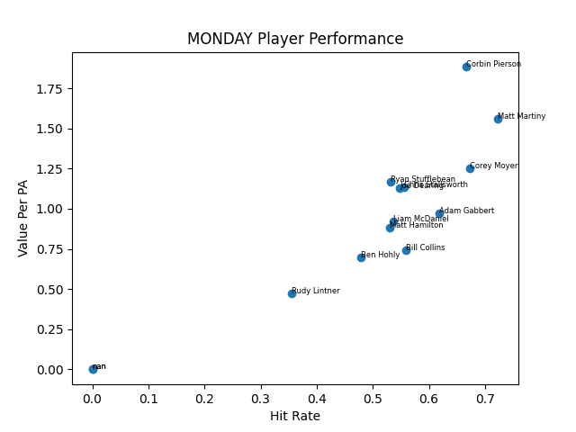

# Slowpitch Performance Lab



A Python-based baseball analytics engine that transforms GameChanger CSV exports into actionable lineup decisions, player evaluations, and scouting-style team insights.

---

## Overview

- Cleans and normalizes multi-header GameChanger exports  
- Builds a custom Offensive Value (OV) metric (wOBA-inspired)  
- Evaluates players using rate-based performance metrics  
- Classifies hitters into archetypes (Power, High Floor, Boom/Bust, etc.)  
- Generates optimized 12-player batting orders  
- Produces automated, human-readable team reports  

---

## Example Output

### Batting Order

```
1. Corey Moyer — Table Setter (OV/PA: 1.82)
2. Matt Martiny — Table Setter (OV/PA: 1.79)
3. Corbin Pierson — Run Producer (OV/PA: 1.75)
...
```

### Team Analysis

```
Strengths:
- Strong contact hitting across lineup
- High overall offensive efficiency

Weaknesses:
- Bottom of lineup shows production drop-off

Key Insight:
- Matt Martiny is the most efficient hitter and should be placed in a high-impact spot (2–4)
```

---

## Core Concepts

- **Offensive Value (OV):** weighted run contribution metric  
- **OV/PA:** efficiency per plate appearance  
- **Hit Rate / XBH Rate / Out Rate:** player profile indicators  
- **Archetypes:** percentile-based classification relative to team environment  

---

## Tech Stack

- Python  
- Pandas / NumPy  
- Matplotlib  

---

## Running the Project

```bash
pip install -r requirements.txt
python src/main.py
```

---

## Why This Matters

This project mirrors real baseball analytics workflows:

- Data cleaning and normalization  
- Metric engineering  
- Player segmentation  
- Lineup optimization  
- Translating data into actionable decisions  

---

## Author

Matt Martiny  
Kansas City, MO